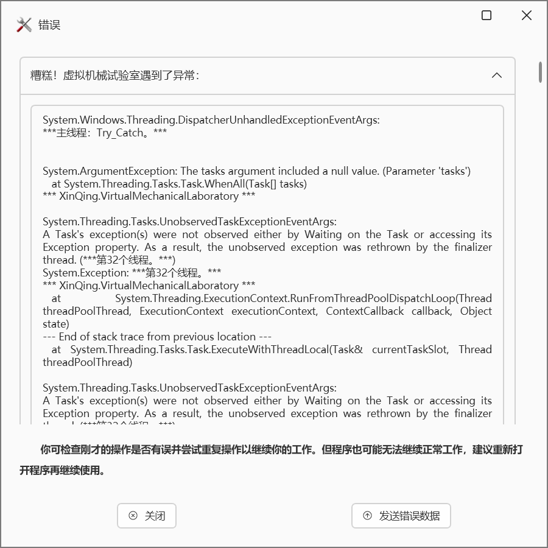

### 该问题是怎么引起的？

#### 在进行什么操作时产生的问题？

（如：在点击计算按钮后）

### 重现步骤
#### 如果该错误可复现，如何操作使产生该错误？

##### 第一步：输入齿轮参数；
##### 第二步：点击计算；
##### 第三步：点击报告选项卡；
##### 第四步：选择导出报告为PDF；
##### 第五步：弹出错误窗口。

### 报错信息

#### 弹出错误窗口时显示的信息，或者你点击发送错误数据按钮后，相关信息会自动保存到剪贴板，将其粘贴在此即可。

