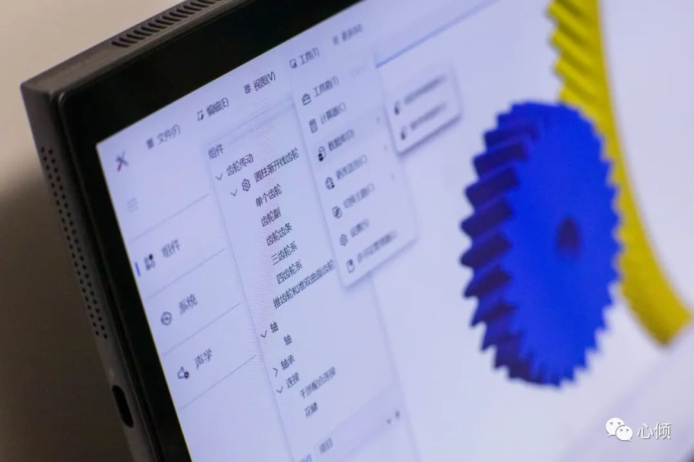

# 虚拟机械试验室
      
    
## 介绍
    
**虚拟机械试验室**旨在作为机械设计工程师的得力工具，帮助工程师快速进行初步零件参数计算、建立机械系统概念模型、搭建详细模型并对系统强度和性能进行仿真。
由于本人技术和精力有限，本软件将长期处于仅能帮助加速进行前期概念模型设计的状态。
    
**下载使用前请先查看[【许可协议】](https://gitee.com/LHTXQ/virtual-mechanical-laboratory/blob/master/Licenses/VirtualMechanicalLaboratoryTrialLicense.txt)**。
     
     
## 界面截图

### 组件界面

    
### 启动界面

### 关于界面

 
    
## 安装教程

1.  xxxx
2.  xxxx
3.  xxxx

## 使用说明

1.  xxxx
2.  xxxx
3.  xxxx

## 技巧

1.  使用
