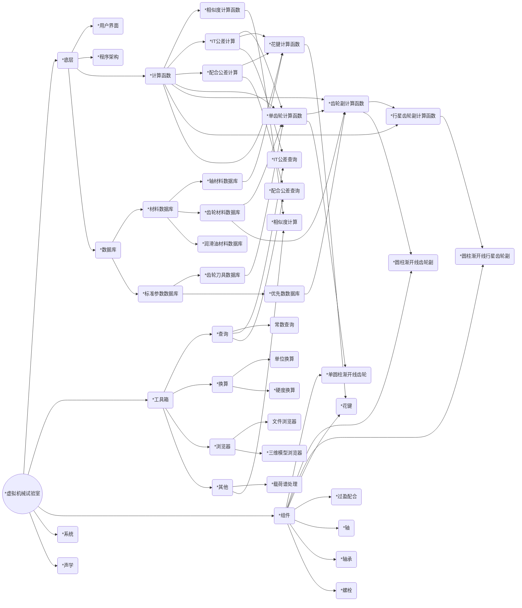
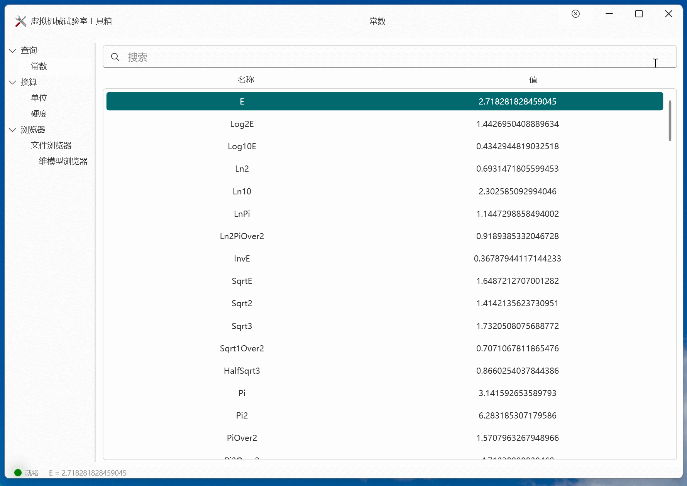
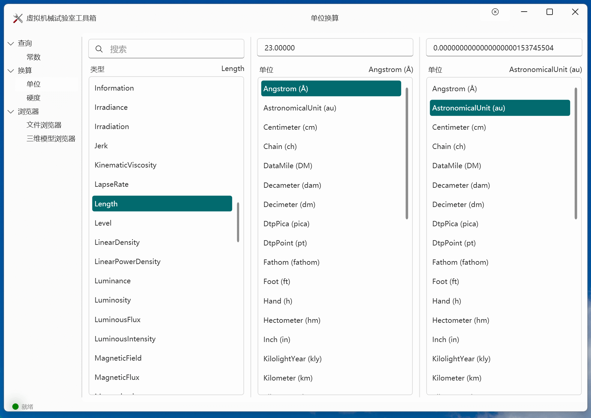
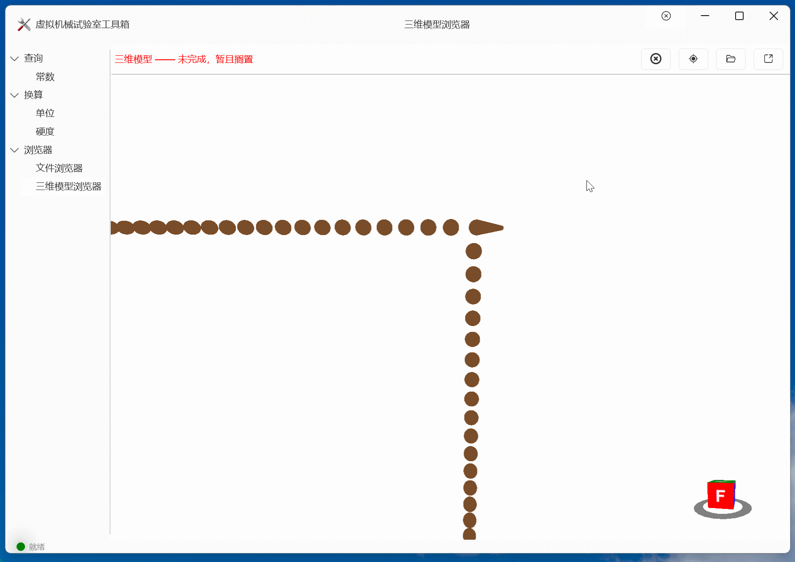

# 虚拟机械试验室

```
注：
    1、建议浏览电脑版网页以查看完整内容，目前仅电脑版可查看路线图和使用目录功能；
    2、本页面含有动图，图片总大小约为 15 MB，请耐心等待加载。
```

  - [介绍](#介绍)
  - [下载地址](#下载地址)
  - [安装教程](#安装教程)
  - [使用说明](#使用说明)
  - [路线图及进度](#路线图及进度)
  - [界面截图](#界面截图)
    - [主程序界面](#主程序界面)
      - [启动界面](#启动界面)
      - [组件界面](#组件界面)
      - [关于界面](#关于界面)
    - [工具箱界面](#工具箱界面)
      - [载荷谱处理界面](#载荷谱处理界面)
      - [常数查询界面](#常数查询界面)
      - [单位换算界面](#单位换算界面)
      - [文件浏览器界面](#文件浏览器界面)
      - [三维模型浏览器界面](#三维模型浏览器界面)
    - [设置界面](#设置界面)
      - [性能设置界面](#性能设置界面)
  - [致谢](#致谢)


## 介绍
    
**虚拟机械试验室**旨在作为机械设计工程师的得力工具，帮助工程师快速进行初步零件参数计算、建立机械系统概念模型、搭建详细模型并对系统强度和性能进行仿真。
由于本人技术和精力有限，本软件将长期处于仅能帮助加速进行前期概念模型设计的状态，暂无法取代其他专业软件。
    
**下载使用前请先查看并同意[【许可协议】](Licenses/)**。

## 下载地址

>尚未发布。

## 安装教程

>待做。

## 使用说明

>待做。

## 路线图及进度

>图中带 * 的为未完成项。



## 界面截图

### 主程序界面

#### 启动界面


#### 组件界面


#### 关于界面


### 工具箱界面

#### 载荷谱处理界面


#### 常数查询界面


#### 单位换算界面


#### 文件浏览器界面


#### 三维模型浏览器界面

 
### 设置界面

#### 性能设置界面


## 致谢

1. 感谢[@1357310795](https://github.com/1357310795)同学对提出无数低级问题的我的耐心指教。
2. 感谢全世界开源软件贡献者们的无私奉献。