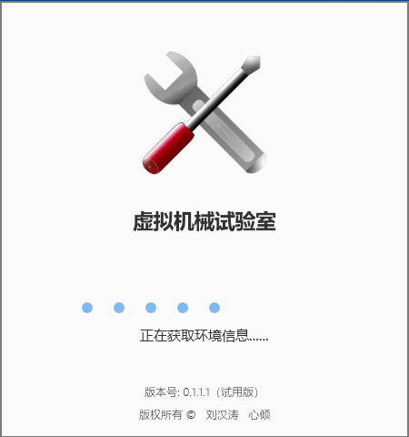
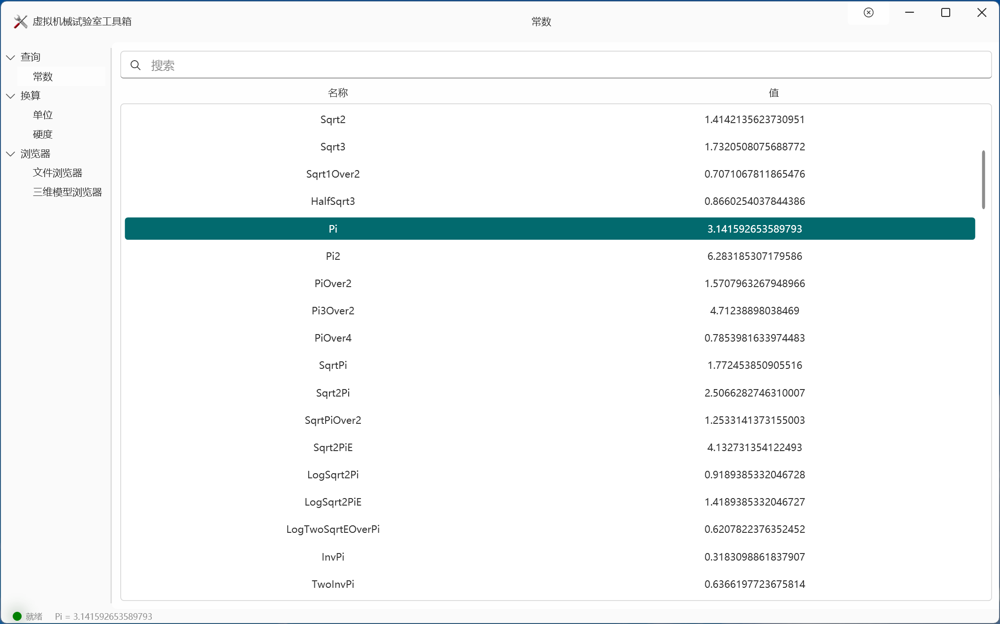
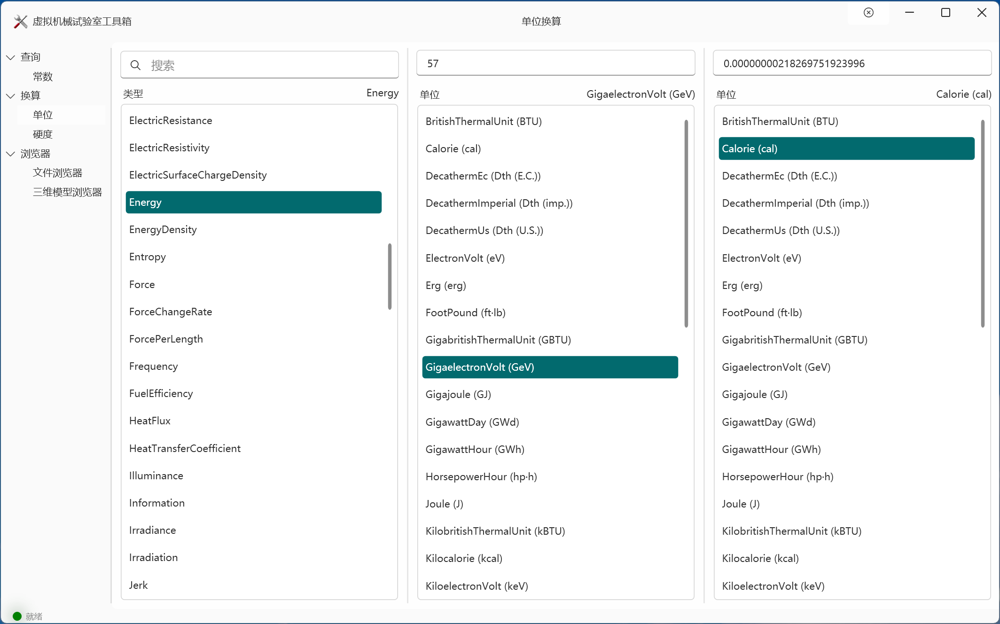
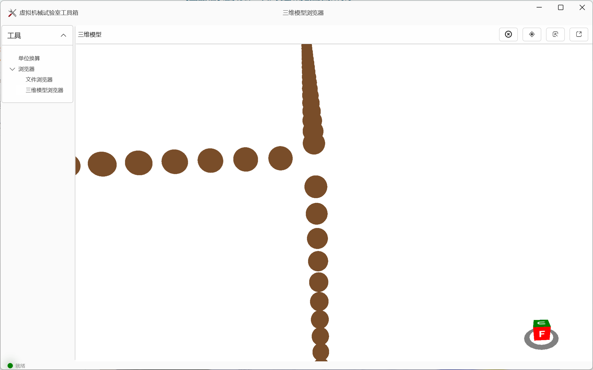
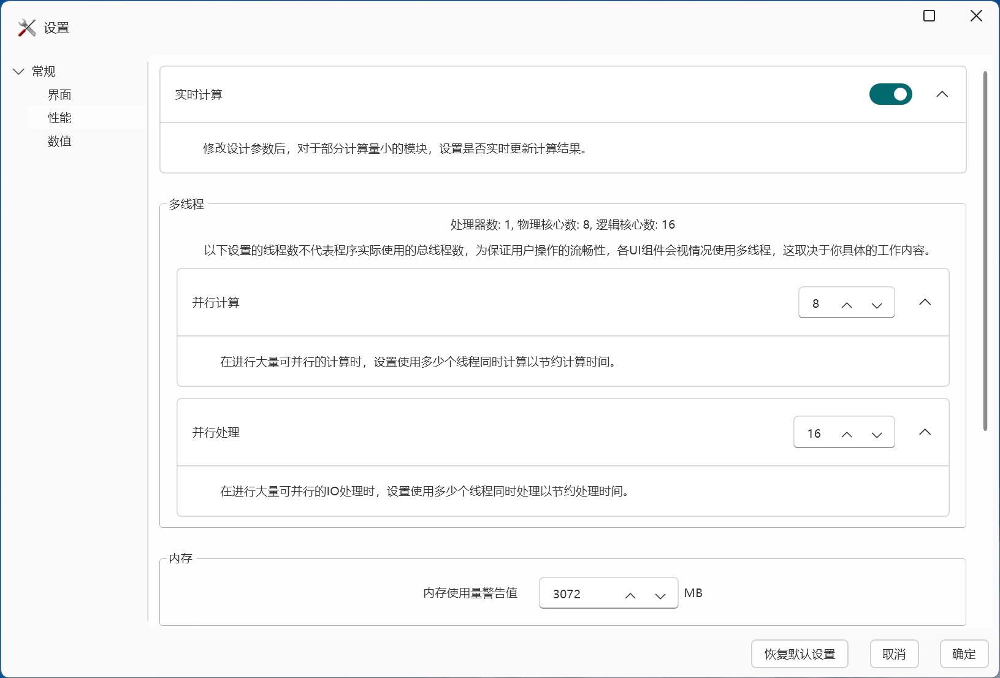

# 虚拟机械试验室
      
    
## 介绍
    
**虚拟机械试验室**旨在作为机械设计工程师的得力工具，帮助工程师快速进行初步零件参数计算、建立机械系统概念模型、搭建详细模型并对系统强度和性能进行仿真。
由于本人技术和精力有限，本软件将长期处于仅能帮助加速进行前期概念模型设计的状态。
    
**下载使用前请先查看[【许可协议】](Licenses/)**。
     
## 下载地址

>尚未发布

## 路线图及进度

- [ ] 界面设计
- - [ ] 自定义控件
- - [x] 设置界面
- - [x] 工具箱界面
- - [ ] 组件界面
- - - [ ] 渐开线圆柱齿轮界面

- [ ] 工具箱
- - [ ] 查询
- - - [x] 常数查询
- - - [ ] IT公差查询
- - - [ ] 配合公差查询
- - [ ] 换算
- - - [x] 单位换算
- - - [ ] 硬度换算
- - [ ] 浏览器
- - - [x] 文件浏览器
- - - [ ] 三维模型浏览器
- - [ ] 其他
- - - [ ] 载荷谱处理

- [ ] 数据库
- - [ ] 材料数据库
- - - [ ] 轴材料数据库
- - - [ ] 齿轮材料数据库
- - - [ ] 轴承材料数据库
- - - [ ] 润滑油材料数据库
- - [ ] 标准参数数据库
- - - [ ] 齿轮刀具参数数据库
- - - [ ] 优先数数据库
    
- [ ] 齿轮计算函数
- - [ ] 圆柱渐开线齿轮计算函数
- - - [ ] 单个齿轮计算函数
- - - [ ] 齿轮副计算函数
- - - [ ] 行星齿轮计算函数

- [ ] 花键计算函数
    
## 界面截图

### 主程序界面

#### 启动界面

#### 组件界面

#### 关于界面

### 工具箱界面

#### 载荷谱处理界面

#### 常数查询界面

#### 单位换算界面

#### 文件浏览器界面

#### 三维模型浏览器界面

 
### 设置界面

#### 性能设置界面

## 安装教程

1.  xxxx
2.  xxxx
3.  xxxx

## 使用说明

1.  xxxx
2.  xxxx
3.  xxxx

## 技巧

1.  xxxx
